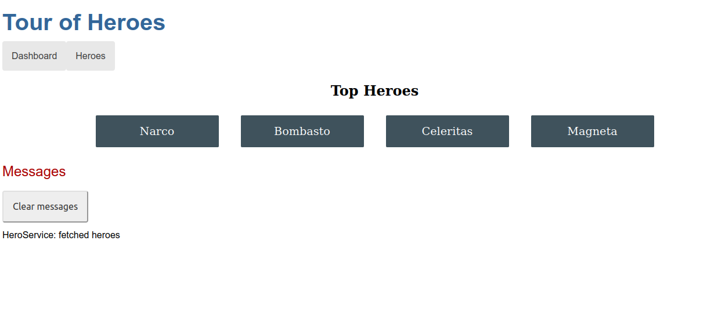

# Tour Of Heroes

In this project I build my own Angular application from the ground up following the tutorial, providing experience with the typical development process, as well as an introduction to basic app-design concepts, tools, and terminology.



## :package: Built With

- HTML
- CSS
- Javascript
- Angular
- npm

## :mag: Live Demo

[Live Demo Link]( https://mcervantes71.github.io/Tour_Of_Heroes/index.html)

## :computer: Getting Started

To get a local copy up and running follow these simple steps.


### Download

1) Clone the repository to your local machine

```sh
  $ git clone https://github.com/mcervantes71/Tour_Of_Heroes.git
```

2) cd into the directory

```sh
  $ cd Tour_Of_Heroes
```

## Development server

Run `ng serve` for a dev server. Navigate to `http://localhost:4200/`. The app will automatically reload if you change any of the source files.

## Code scaffolding

Run `ng generate component component-name` to generate a new component. You can also use `ng generate directive|pipe|service|class|guard|interface|enum|module`.

## Build

Run `ng build` to build the project. The build artifacts will be stored in the `dist/` directory.

## Running unit tests

Run `ng test` to execute the unit tests via [Karma](https://karma-runner.github.io).

## Running end-to-end tests

Run `ng e2e` to execute the end-to-end tests via a platform of your choice. To use this command, you need to first add a package that implements end-to-end testing capabilities.

## Further help

To get more help on the Angular CLI use `ng help` or go check out the [Angular CLI Overview and Command Reference](https://angular.io/cli) page.


## :busts_in_silhouette: Authors

👤 **Martin Cervantes**

- Linkedin: [Martin Cervantes](https://www.linkedin.com/in/cervantesmartin/)
- Twitter: [@M4rt1nC3rv4nt3s](https://twitter.com/M4rt1nC3rv4nt3s)
- Github: [@mcervantes71](https://github.com/mcervantes71)
- Gmail: [cervantes.martine](mailto:cervantes.martine@gmail.com)

## 🤝 Contributing

    Contributions, issues and feature requests are welcome!

Feel free to check the [issues page](../../issues).

## :star2: Show your support

    Give a ⭐️ if you like this project!

## 📝 License

This project is [MIT](lic.url) licensed.
